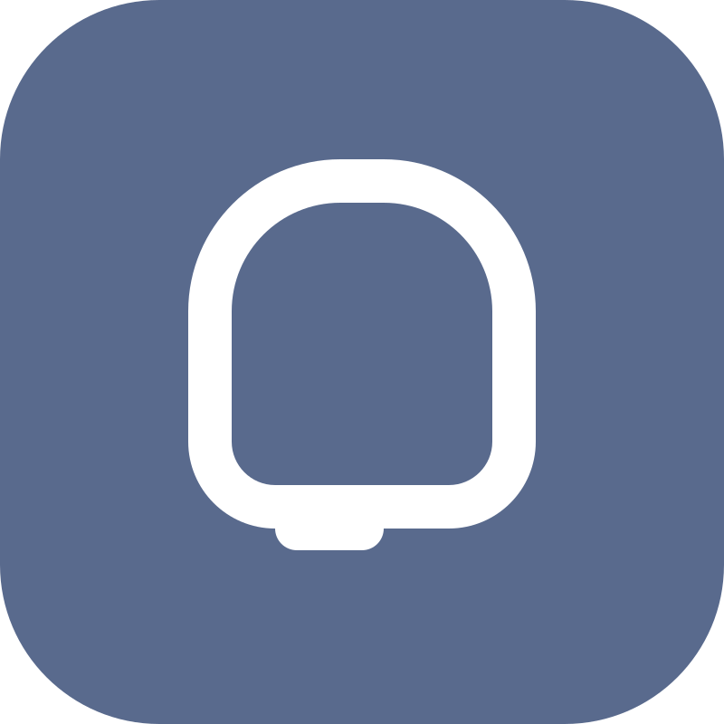

# Android 通知图标适配计划

[](https://github.com/BetterAndroid/android-notification-icon-project/blob/main/LICENSE)
[](https://t.me/BetterAndroid_Dev)
[](https://qm.qq.com/cgi-bin/qm/qr?k=Pnsc5RY6N2mBKFjOLPiYldbAbprAU3V7&jump_from=webapi&authKey=X5EsOVzLXt1dRunge8ryTxDRrh9/IiW1Pua75eDLh9RE3KXE+bwXIYF5cWri/9lf)



为不符合 Android 原生通知设计的应用与厂商系统提供规范的单色图标资源。

[English](README.md) | 简体中文

|  | [BetterAndroid](https://github.com/BetterAndroid) |
| ------------------------------------------------------------------------------------------------------------------------------- | ------------------------------------------------- |

这个项目属于上述组织，**点击上方链接关注这个组织**，发现更多好项目。

## 这是什么

这是一个 Android 通知图标适配计划，为不符合 Android 原生通知设计的应用与厂商系统提供规范的单色图标资源。

这个项目设立的初衷是为了规范混乱的第三方应用生态，让第三方应用的通知图标也能按照原生 Android 通知图标的规范进行设计。

这一切的原因归根结底其实是当初 MIUI 不规范的小米推送通知图标导致的生态割裂问题，其他厂商也没有完全解决这个问题，而是普遍采用了 Apple 方案使用应用的桌面图标作为主要通知图标这种欺骗意义上的 “解决方案”，或者是 vivo 采用的自己维护一套单色通知图标的方案，但是在后来的 OriginOS 中也逐步放弃了。

作为这个项目的负责人，我的观点是，这个问题的责任在 Google，Android 明确规定了通知图标的设计规范，但 Google 并没有对厂商进行强制约束，导致厂商可以随意破坏原生通知图标的设计规范。

最后甚是可笑的是，Google 也在 Android 16 放弃了强制着色通知图标的设计规范，并在通知面板中将通知图标设置成了应用的桌面图标，完成了对生态的全面妥协。

这个从 2022 年开始启动的项目原名叫 **AndroidNotifyIconAdapt**，当年这个四不像的名字也一度导致项目空有资源但没有规范，现在它正式更名为 **Android Notification Icon Project** (代号为 **ANIP**)，并对原始的图标资源规则进行了全面改版，项目后期将全面投入更现代的持续社区维护中。

项目已由原 **AGPL-3.0** 许可协议调整至 **Apache-2.0**，ANIP 将以当前协议继续对外开放，任何人都可以在遵守协议的前提下使用、修改、分发本项目的资源，协议的变更不自动适用于之前的版本。

## 开始使用

|  | [ANIP 文档](https://betterandroid.github.io/android-notification-icon-project/zh-cn) |
| ------------------------------------------------------------------- | ------------------------------------------------------------------------------------ |

你可以前往文档页面查看如何使用现有图标资源及请求适配或参与社区维护。

## 商标声明

所有在本项目中展示的产品名称、徽标和品牌均为其各自所有者的财产。本存储库中使用的所有公司、产品和服务名称仅用于识别、兼容性和说明目的。使用这些名称、徽标和品牌并不意味着认可。

## 更多项目

<!--suppress HtmlDeprecatedAttribute -->
<div align="center">
    <h2>嘿，还请君留步！👋</h2>
    <h3>如果你觉得这个项目能给你提供帮助，不妨继续往下看看我的更多项目吧！</h3>
    <h3>如果这些项目能为你提供帮助，不妨为我点个关注或者 star ⭐️ 吧！</h3>
    <h1><a href="https://github.com/fankes/fankes/blob/main/project-promote/README-zh-CN.md">→ 查看更多关于我的项目，请点击这里 ←</a></h1>
</div>

## Star History

[](https://www.star-history.com/?repos=BetterAndroid%2Fandroid-notification-icon-project&type=date&legend=top-left)

## 许可证

- [Apache-2.0](https://www.apache.org/licenses/LICENSE-2.0)

```
Apache License Version 2.0

Copyright (C) 2019 HighCapable

Licensed under the Apache License, Version 2.0 (the "License");
you may not use this file except in compliance with the License.
You may obtain a copy of the License at

    https://www.apache.org/licenses/LICENSE-2.0

Unless required by applicable law or agreed to in writing, software
distributed under the License is distributed on an "AS IS" BASIS,
WITHOUT WARRANTIES OR CONDITIONS OF ANY KIND, either express or implied.
See the License for the specific language governing permissions and
limitations under the License.
```

版权所有 © 2019 HighCapable